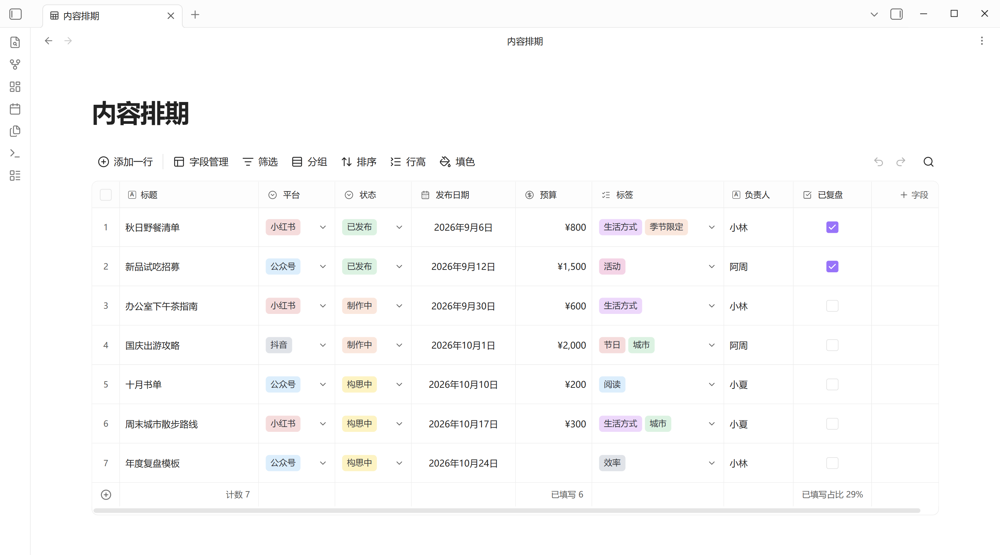
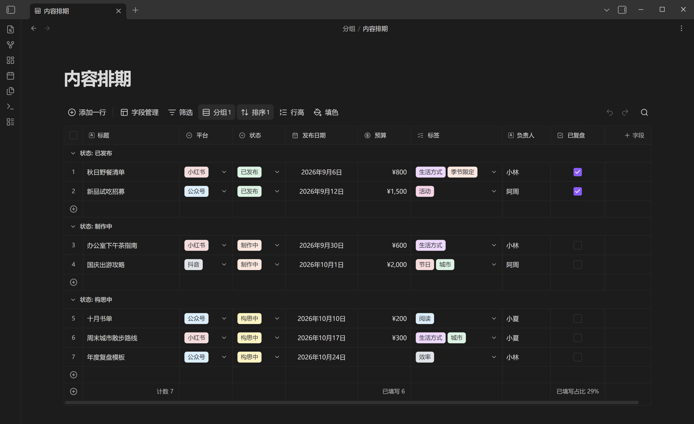
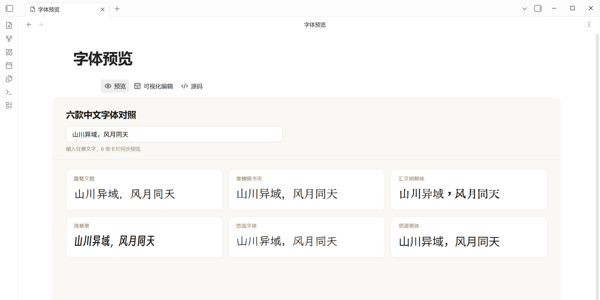

# 轻格 LiteGrid

**简体中文** | [English](README.en.md)

**轻负担、高审美的 CSV 与 HTML 编辑器。**

轻格面向喜欢安静、清晰界面的人：保留结构化编辑需要的能力，把复杂功能收进需要时才出现的菜单里，让数据自然地待在 Obsidian 中。



## 功能

- 直接在 Obsidian 中打开、编辑并保存 `.csv` 文件
- 字段类型：文本、数字、货币、单选、多选、日期、复选框、链接、邮箱、电话、图片与索引
- 筛选、分组、排序、条件填色、行高与列宽调整
- Obsidian 内部链接索引与本地图片预览
- 预览、可视化编辑 `.html` / `.htm`，并可随时切换源码；预览时页面自带的脚本在隔离沙盒中运行
- 本地优先：不上传资料库内容，不依赖云端服务，不包含遥测

## 截图

### 分组、排序与深色主题



### HTML 预览

打开 `.html` 默认进入预览，页面自带的脚本照常运行；需要修改时，一键切换「可视化编辑」或「源码」。



## 设计原则

- **低负担**：无需学习一套新的数据库系统
- **低刺激**：克制的颜色、留白和交互反馈
- **原生感**：尽量沿用 Obsidian 的主题变量与交互习惯
- **文件优先**：数据仍然是普通的 CSV 与 HTML 文件

## 安装

### 社区插件

在 **设置 → 第三方插件 → 浏览** 中搜索 `LiteGrid` 安装。

### 手动安装

1. 下载最新 Release 中的 `main.js`、`manifest.json` 和 `styles.css`。
2. 在资料库中创建 `.obsidian/plugins/litegrid/`。
3. 将三个文件放入该目录。
4. 重新加载 Obsidian，并在 **设置 → 第三方插件** 中启用 **LiteGrid（轻格）**。

## 开发

```bash
npm install
npm run lint
npm run build
```

发布文件为仓库根目录下的 `main.js`、`manifest.json` 与 `styles.css`。

## 隐私

轻格离线运行，不收集分析数据，不发送文件名或资料库内容。图片与索引功能仅访问当前 Obsidian 资料库中的本地文件。

HTML 预览会运行页面自带的脚本，但脚本被关在隔离沙盒里：不能调用 Obsidian，也不能通过网络请求读取本机文件。来源不明的 HTML 建议先用「源码」查看。

## 许可证

[0BSD](LICENSE)
